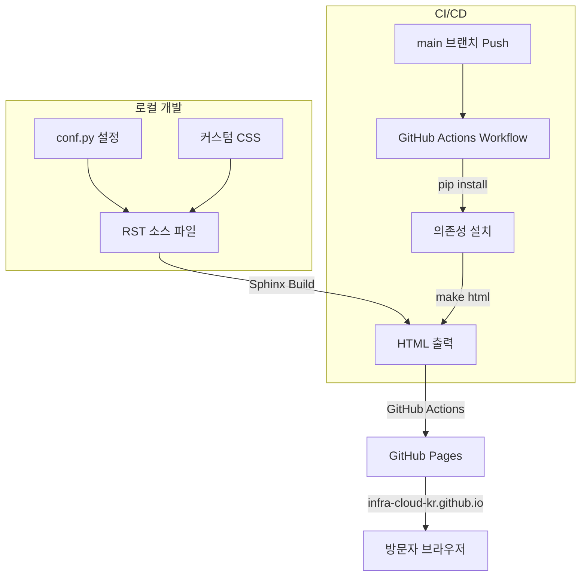
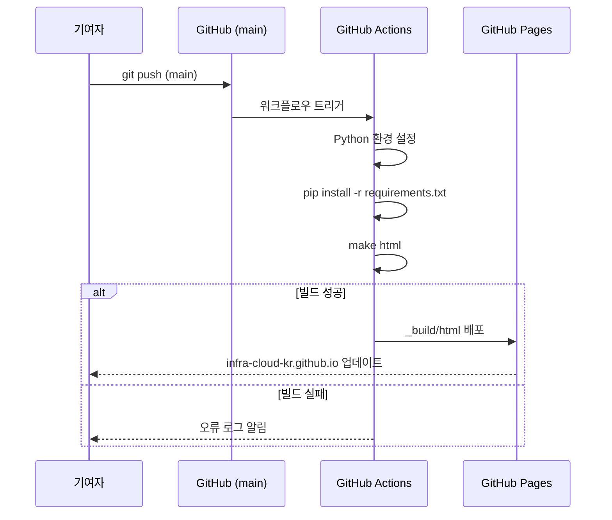

# 설계 문서: sphinx-landing-page

## 개요

infra-cloud-kr 커뮤니티를 위한 정적 랜딩 페이지를 Sphinx + reStructuredText(RST)로 구축한다. 이 사이트는 GitHub Pages(`infra-cloud-kr.github.io`)를 통해 호스팅되며, GitHub Actions CI/CD 파이프라인으로 자동 배포된다.

Sphinx는 Python 기반 문서 빌드 도구로, RST 소스를 HTML로 변환한다. 커뮤니티 랜딩 페이지 용도로 Sphinx를 선택한 이유는:
- RST 기반의 구조화된 콘텐츠 관리
- 풍부한 테마 생태계 (반응형 디자인 지원)
- GitHub Pages와의 자연스러운 통합
- Python 생태계의 안정적인 의존성 관리

## 아키텍처

### 전체 구조



### 디렉토리 구조

```
infra-cloud-kr.github.io/
├── source/
│   ├── conf.py              # Sphinx 설정 파일
│   ├── index.rst             # 메인 랜딩 페이지 (진입점)
│   └── _static/
│       └── custom.css        # 커스텀 스타일시트
├── Makefile                  # 로컬 빌드 명령
├── make.bat                  # Windows 빌드 명령
├── requirements.txt          # Python 의존성
├── README.md                 # 개발 가이드
├── .github/
│   └── workflows/
│       └── deploy.yml        # GitHub Pages 배포 워크플로우
├── .gitignore
└── LICENSE
```

### 빌드 흐름



## 컴포넌트 및 인터페이스

### 1. Sphinx 설정 (`conf.py`)

Sphinx 프로젝트의 핵심 설정 파일. 테마, 확장, 언어, 메타데이터 등을 정의한다.

```python
# conf.py 주요 설정
project = 'infra-cloud-kr'
author = 'infra-cloud-kr community'
language = 'ko'

extensions = []

html_theme = 'alabaster'  # 또는 'sphinx_rtd_theme', 'furo' 등
html_static_path = ['_static']
html_css_files = ['custom.css']

html_title = 'infra-cloud-kr - 한국 인프라 클라우드 커뮤니티'
html_short_title = 'infra-cloud-kr'
```

**테마 선택 근거:**
- `alabaster`: Sphinx 기본 내장 테마, 깔끔하고 가벼움, 추가 의존성 없음
- `furo`: 현대적 디자인, 반응형 지원 우수, 다크모드 지원
- `sphinx_rtd_theme`: Read the Docs 스타일, 문서 사이트에 널리 사용

`furo` 테마를 권장한다. 반응형 디자인이 기본 지원되고, 현대적인 UI를 제공하며, 커스터마이징이 용이하다.

### 2. 메인 페이지 (`index.rst`)

단일 페이지 랜딩 구조. RST의 섹션과 디렉티브를 활용하여 콘텐츠를 구성한다.

**페이지 섹션 구성:**

| 섹션 | 설명 | RST 구현 |
|------|------|----------|
| 히어로 | 커뮤니티 이름 + 소개 문구 | 제목 + 단락 |
| 미션 | OpenInfra × Cloud Native 연결 미션 | 섹션 + 단락 |
| Linux Foundation | LF 산하 프로젝트 명시 | 섹션 + 단락 |
| 참여 방법 | GitHub, 소셜 미디어 링크 | 섹션 + 링크 목록 |
| 푸터 | 저작권, 라이선스 | conf.py `html_footer` 또는 커스텀 템플릿 |

### 3. 커스텀 CSS (`_static/custom.css`)

테마 위에 적용되는 커스텀 스타일. `conf.py`의 `html_css_files` 설정을 통해 로드된다.

### 4. GitHub Actions 워크플로우 (`deploy.yml`)

```yaml
# .github/workflows/deploy.yml 구조
name: Deploy to GitHub Pages
on:
  push:
    branches: [main]

jobs:
  build-and-deploy:
    runs-on: ubuntu-latest
    steps:
      - uses: actions/checkout@v4
      - uses: actions/setup-python@v5
      - run: pip install -r requirements.txt
      - run: make html
      - uses: actions/deploy-pages@v4  # GitHub Pages 배포
```

### 5. Makefile

Sphinx의 `sphinx-quickstart`가 생성하는 표준 Makefile을 기반으로 한다.

```makefile
SPHINXBUILD   = sphinx-build
SOURCEDIR     = source
BUILDDIR      = _build

html:
	$(SPHINXBUILD) -b html $(SOURCEDIR) $(BUILDDIR)/html
```

## 데이터 모델

이 프로젝트는 데이터베이스를 사용하지 않는 정적 사이트이다. 데이터는 다음 형태로 관리된다:

### 콘텐츠 데이터 (RST 파일)

| 항목 | 형식 | 위치 |
|------|------|------|
| 페이지 콘텐츠 | reStructuredText | `source/index.rst` |
| 사이트 설정 | Python | `source/conf.py` |
| 커스텀 스타일 | CSS | `source/_static/custom.css` |

### 빌드 산출물

| 항목 | 형식 | 위치 |
|------|------|------|
| HTML 페이지 | HTML | `_build/html/` |
| 정적 자산 | CSS/JS/이미지 | `_build/html/_static/` |

### 설정 데이터 (`conf.py` 주요 필드)

| 필드 | 타입 | 설명 |
|------|------|------|
| `project` | `str` | 프로젝트 이름 |
| `language` | `str` | 사이트 언어 (`'ko'`) |
| `html_theme` | `str` | 적용 테마 이름 |
| `html_title` | `str` | HTML `<title>` 태그 값 |
| `html_static_path` | `list[str]` | 정적 파일 디렉토리 |
| `html_css_files` | `list[str]` | 추가 CSS 파일 목록 |

## 정확성 속성 (Correctness Properties)

*속성(Property)은 시스템의 모든 유효한 실행에서 참이어야 하는 특성 또는 동작이다. 속성은 사람이 읽을 수 있는 명세와 기계가 검증할 수 있는 정확성 보장 사이의 다리 역할을 한다.*

### Property 1: 네비게이션 앵커 무결성

*For any* 빌드된 HTML 페이지 내의 네비게이션 링크에 대해, 해당 링크의 `href` 앵커(`#section-id`)가 가리키는 대상 요소(`id` 속성)가 동일 페이지 내에 반드시 존재해야 한다.

**Validates: Requirements 4.2**

### Property 2: 이미지 대체 텍스트 존재

*For any* 빌드된 HTML 페이지 내의 `` 태그에 대해, 비어있지 않은 `alt` 속성이 반드시 존재해야 한다.

**Validates: Requirements 7.3**

### Property 3: 시맨틱 헤딩 계층 준수

*For any* 빌드된 HTML 페이지 내의 헤딩 태그 시퀀스(`h1`~`h6`)에 대해, 헤딩 레벨이 1단계 이상 건너뛰지 않아야 한다 (예: `h1` 다음에 `h3`이 바로 올 수 없다).

**Validates: Requirements 7.4**

## 오류 처리

### Sphinx 빌드 오류

| 오류 상황 | 처리 방법 |
|-----------|-----------|
| RST 문법 오류 | Sphinx가 경고/오류 메시지 출력, 빌드 중단 |
| 누락된 참조 (이미지, 링크) | Sphinx 경고 출력, 빌드는 계속 진행 |
| 의존성 미설치 | Python ImportError 발생, 명확한 오류 메시지 |
| 테마 미설치 | Sphinx ThemeError 발생, 빌드 중단 |

### GitHub Actions 배포 오류

| 오류 상황 | 처리 방법 |
|-----------|-----------|
| 빌드 실패 | 워크플로우 중단, 배포 스킵, 로그에 오류 기록 |
| 배포 권한 오류 | GitHub Actions 로그에 권한 오류 기록 |
| 네트워크 오류 | GitHub Actions 자동 재시도 메커니즘 활용 |

### 설계 결정

- Sphinx의 기본 오류 처리 메커니즘을 활용한다. 별도의 오류 처리 코드를 작성하지 않는다.
- GitHub Actions 워크플로우에서 빌드 스텝이 실패하면 후속 배포 스텝이 자동으로 스킵된다.
- `make html` 실행 시 Sphinx의 `-W` 플래그(경고를 오류로 처리)를 CI에서 사용하여 품질을 보장한다.

## 테스팅 전략

### 이중 테스트 접근법

단위 테스트와 속성 기반 테스트를 병행하여 포괄적인 검증을 수행한다.

### 단위 테스트 (pytest)

특정 예시와 엣지 케이스를 검증한다:

- **프로젝트 구조 검증**: 필수 파일(`conf.py`, `index.rst`, `requirements.txt`, `Makefile`) 존재 확인
- **conf.py 설정 검증**: `language='ko'`, `html_theme` 설정, `html_css_files` 설정 확인
- **콘텐츠 검증**: 빌드된 HTML에서 필수 섹션(히어로, 미션, 참여 방법, 푸터) 존재 확인
- **SEO 검증**: `<title>` 태그, `lang="ko"` 속성, meta description 존재 확인
- **GitHub Actions 워크플로우 검증**: `deploy.yml` 파일 존재, main 브랜치 트리거 설정 확인
- **커스텀 CSS 적용 검증**: 빌드된 HTML에 커스텀 CSS 파일 링크 포함 확인

### 속성 기반 테스트 (Hypothesis)

Python 속성 기반 테스트 라이브러리인 **Hypothesis**를 사용한다. 각 테스트는 최소 100회 반복 실행한다.

- **Property 1 테스트**: 빌드된 HTML을 파싱하여 모든 내부 앵커 링크의 대상 ID가 존재하는지 검증
  - 태그: `Feature: sphinx-landing-page, Property 1: 네비게이션 앵커 무결성`
- **Property 2 테스트**: 빌드된 HTML을 파싱하여 모든 `` 태그에 비어있지 않은 `alt` 속성이 있는지 검증
  - 태그: `Feature: sphinx-landing-page, Property 2: 이미지 대체 텍스트 존재`
- **Property 3 테스트**: 빌드된 HTML을 파싱하여 헤딩 태그 시퀀스가 레벨을 건너뛰지 않는지 검증
  - 태그: `Feature: sphinx-landing-page, Property 3: 시맨틱 헤딩 계층 준수`

### 테스트 도구

| 도구 | 용도 |
|------|------|
| `pytest` | 단위 테스트 프레임워크 |
| `hypothesis` | 속성 기반 테스트 라이브러리 |
| `beautifulsoup4` | HTML 파싱 (테스트에서 빌드 결과물 분석) |

### 테스트 실행

```bash
# 전체 테스트 실행
pytest tests/ -v

# 속성 기반 테스트만 실행
pytest tests/ -v -k "property"
```

각 속성 기반 테스트는 단일 Hypothesis 테스트로 구현하며, 설계 문서의 속성 번호를 주석으로 참조한다.
